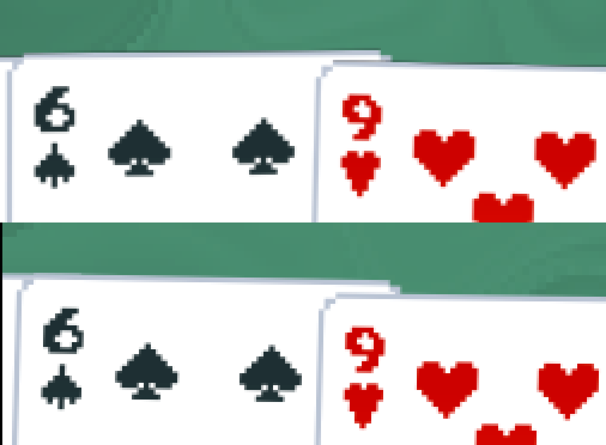

# Illusion

Pedantic graphical enhancements for Balatro.

## Requirements

- [Lovely](https://github.com/ethangreen-dev/lovely-injector) - a Balatro injector.

## Installation

1. Install [Lovely](https://github.com/ethangreen-dev/lovely-injector?tab=readme-ov-file#manual-installation).
2. Download the [latest release](https://github.com/jonathandw743/Illusion/releases/) of this mod.
3. Unzip the folder, and move it into the `%appdata%/Balatro/Mods` folder (or `~/.steam/steam/steamapps/compatdata/2379780/pfx/drive_c/users/steamuser/AppData/Roaming/Balatro` on linux). This mod must be in the `Illusion` directory.
4. Restart the game to load the mod.

## Features

- Fixed sprite edges
- Better pixel smoothing

## Details

In Love2D, when there is a transparent and opaque pixel next to each other in a texture, and there is interpolation between them, the RGB of the transparent pixel (stil stored in the .png) will be interpolated with the RGB of the opaque pixel. This means that if there is an opaque white pixel next to a transparent pixel whose RGB values happen to be 0, 0, 0, the interpolated colour will be translucent grey. To fix this, you can set the RGB values of transparent pixels in a texture to the RGB of the nearest opaque pixel.

The images in `resources/textures` are processed versions of the vanilla Balatro sprite atlases. These have the transparent pixels recolorized using [transparency_recolorizer](https://github.com/jonathandw743/transparency_recolorizer). You can use this tool if you want to fix the transparency on the edges of your own modded images.

See the line of dark pixels along the top edge of the cards in the top image (before) compared to the bottom image (after):

Balatro uses double resolution sprite atlases with a linear sampler to achieve pixel smoothing. The effectiveness of this method is resolution-dependent: at high resolutions, sprites will look blurry and at low resolutions. [readabletro](https://github.com/bladeSk/readabletro) replaces Balatro's pixel art with smoothed sprites. This mod retains the pixel art.

Left before, right after (captured at 4k):

## Contributing

Any suggestions (create an issue) or pull requests are welcome. This mod is intended to maintain the vanilla graphics of Balatro.
